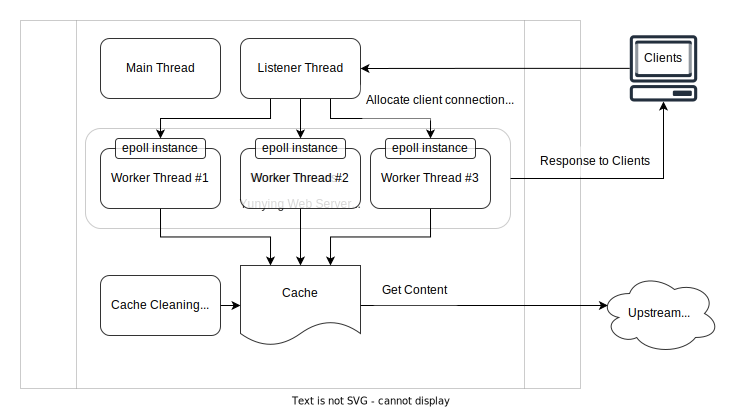

# Yunying HTTP Server
Yunying(云影) is a simple HTTP server that supports static file serving, reverse proxy and in-memory cache. It is written in C++ and uses [epoll](https://man7.org/linux/man-pages/man7/epoll.7.html) to handle network events.

Yunying can now serve static files and reverse proxy for other HTTP or HTTPS servers. It cannot serve HTTPS yet.

## Contents
* [Build and Run](#build-and-run)
* [Design](#design)
  + [Thread Model](#thread-model)
  + [Some Objedct-Oriented Design Practices](#some-objedct-oriented-design-practices)
* [Performance Benchmarks](#performance-benchmarks)
  + [Reverse Proxy for Wikipedia](#reverse-proxy-for-wikipedia)
* [Libraries Used](#libraries-used)


## Build and Run
You need a Linux machine and CMake to build and run Yunying.

After cloning this repository, you should first initialize the submodules:
```bash
git submodule update --init --recursive
```

Then you can build Yunying with CMake:

```bash
cmake -B build
cmake --build build
```

After build, you will get `yunying` executable file. You can refer to the [config document](docs/config.md) to edit the config file. After editing the config file, you can run it directly:
```bash
build/yunying [config_file] # config_file can be omitted, default to ./config.lua
```

Recerence: [Configuration Document](docs/config.md)

## Design
Yunying is a single-process, multi-threaded web server. 

### Thread Model
Yunying utilizes four types of threads in its architecture:
* Main thread: The entrance and control thread for the server.
* Listener thread: Listens for connections from clients and allocate them to worker threads via epoll instances.
* Worker threads: Could have multiple worker threads. They interact with clients via connections, parse and craft HTTP requests and responses; using cache to get conntents from either upstream server or the disk.
* Cache cleaning thread: Free up expired cache items from memory periodically.

Below diagram shows the thread model of Yunying, note that Cache is not belong to any thread, it's a piece of memory that all worker threads and cache cleaning thread can access.



### Some Objedct-Oriented Design Practices
Singleton Pattern: The `Conf` instance and the `Metrics` instance are implemented as singletons. This design enables effortless access to configurations or the ability to record metrics from anywhere in the program by obtaining the instances easily.

Abstract Class: The `Origin` class serves as an abstract class representing the content origin. It can be specialized into either `UpstreamOrigin` or `StaticFileOrigin`. The abstract class defines two pure virtual methods:

```cpp
virtual std::string getKey(HttpRequest request) = 0;
virtual HttpResponse* get(HttpRequest request, int* max_age) = 0;
```

These methods are utilized by the cache module to retrieve keys for indexing cache items and obtaining contents along with their expiration age in the cache. Both `UpstreamOrigin` and `StaticFileOrigin` inherit from the `Origin` class and provide corresponding implementations of these two methods to cater to different types of content origins.


## Performance Benchmarks
Run benchmarks with [wrk](https://github.com/wg/wrk) in a cloud server with 2 CPU cores and 2 GB memory.

### Reverse Proxy for Wikipedia
Run wrk for two URLs, one is a `301` page which is short and the other is the main page of en.wikipedia.org which is relatively long. The results are as follows:

```bash
$ wrk -t4 -c1000 -d60s http://localhost:8080/ # 301 page
Running 1m test @ http://localhost:8080/
  4 threads and 1000 connections
  Thread Stats   Avg      Stdev     Max   +/- Stdev
    Latency    20.09ms   26.16ms   1.70s    99.57%
    Req/Sec    11.06k     2.14k   21.18k    71.05%
  2638746 requests in 1.00m, 2.52GB read
  Socket errors: connect 0, read 0, write 0, timeout 74
Requests/sec:  43919.38
Transfer/sec:     42.93MB

$ wrk -t4 -c1000 -d60s http://localhost:8080/wiki/Main_Page # Wikipedia main page
Running 1m test @ http://localhost:8080/wiki/Main_Page
  4 threads and 1000 connections
  Thread Stats   Avg      Stdev     Max   +/- Stdev
    Latency    90.47ms   15.09ms 200.38ms   77.62%
    Req/Sec     2.77k   238.44     3.52k    71.24%
  661140 requests in 1.00m, 63.89GB read
Requests/sec:  11004.69
Transfer/sec:      1.06GB
```

## Libraries Used
- [Lua](https://www.lua.org/) - A lightweight scripting language, used as the configuration language of Yunying.
- [sol2](https://sol2.readthedocs.io/en/latest/) - A C++ wrapper for Lua.
- [libcurl](https://curl.se/libcurl/) - A C library for transferring data with URL syntax, used for upstream requests.
- [Google Test](https://google.github.io/googletest/) - A C++ testing framework.